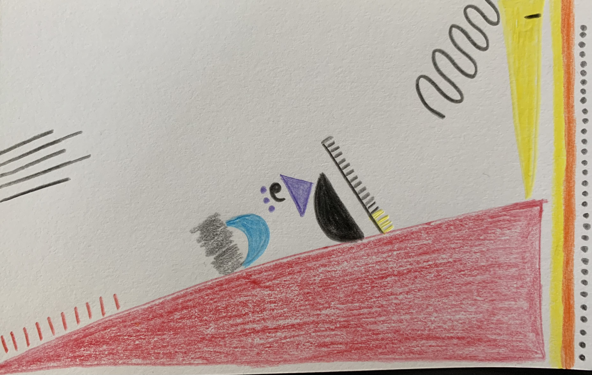

# Gabriela Ayala

### Hello! :wave:

I am a 2nd year MSCAPP student at the University of Chicago. I am from Ecuador and I absolutely *love dogs and chocolate*. I have three chihuahuas and one of them, Ramona, lives with me in Chicago.

I am looking forward to learning about different data visualization techniques and how to leverage them for public policy issues. Here's my data selfie that says a little more about me. [^1]

---

[^1]: More info on data selfies [here:](https://ideas.ted.com/how-to-draw-your-own-selfie-using-your-personal-data/)
