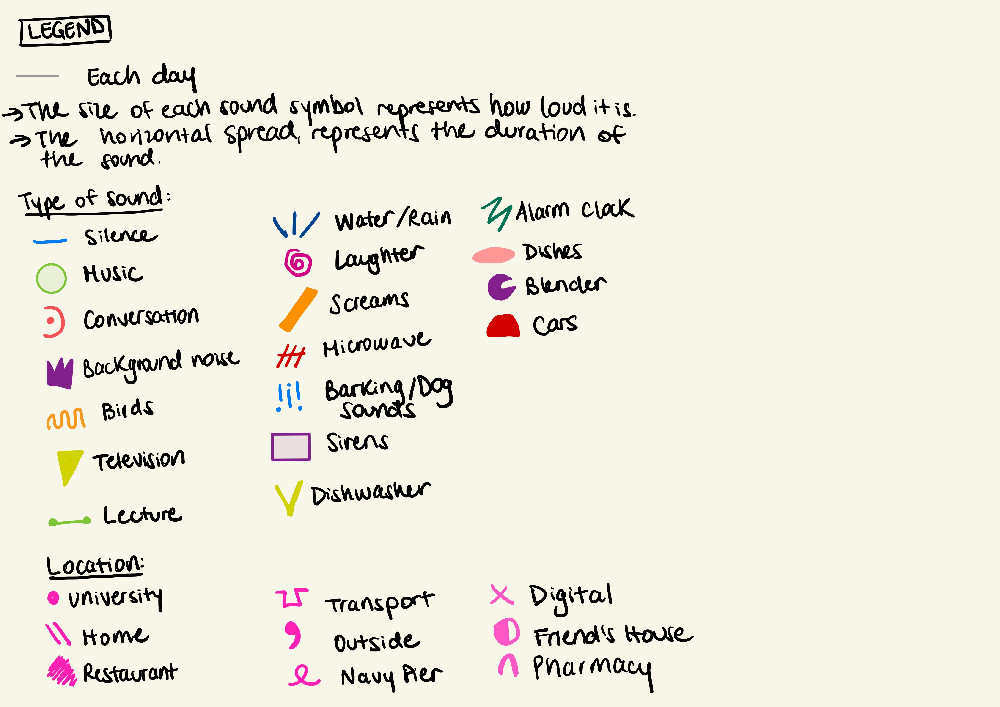

# Project 1: Dear Data

For my project, I decided to track the variety and intensity of sounds 🔉 🔔 🔊 I encountered from Wednesday to Sunday. I have to say, I have never before paid that much attention to the different sounds around me and I realized I tend to automatically ignore certain sounds like background noise. In a way, this data visualization represents the sounds I paid attention to, and it's likely not comprehensive of all the sounds I came across.

Each light gray horizontal line represents one of the 5 days I tracked and the symbols are located in the order and time of day I encountered them. The size of the symbol represents the intensity or how loud the sound was and its horizontal spread represents the duration. I also tracked where each sound was heard, which is represented by all the pink symbols.

## Data Visualization

## Legend

